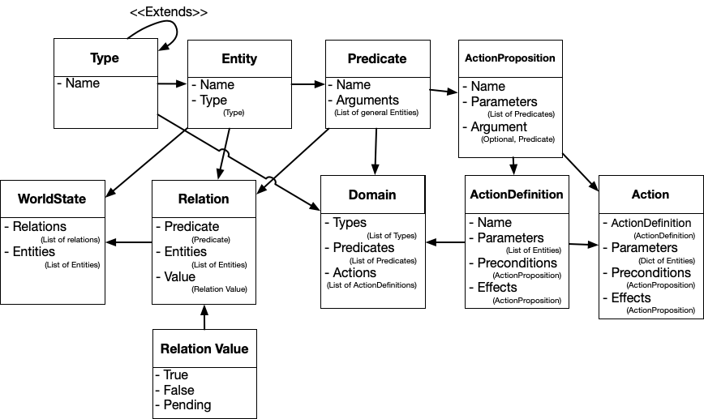

# EV_PDDL

EV_PDDL is a library that can parse a domain/problem PDDL files and gives a model that can be used to keep track of a game environment with the use of worldstate and actions. 

This image shows the structure of the model of the PDDL framework.

## Project Status
The project is actively under developement. Once all the major components will be ready there will be a release. 

## Usage
Please contact [Giulio Mori](https://github.com/liogiu2) for any questions about how is it used.

## Contributing
Pull requests are welcome, but please open an issue first to discuss what you would like to change.

## License
[MIT](https://choosealicense.com/licenses/mit/)